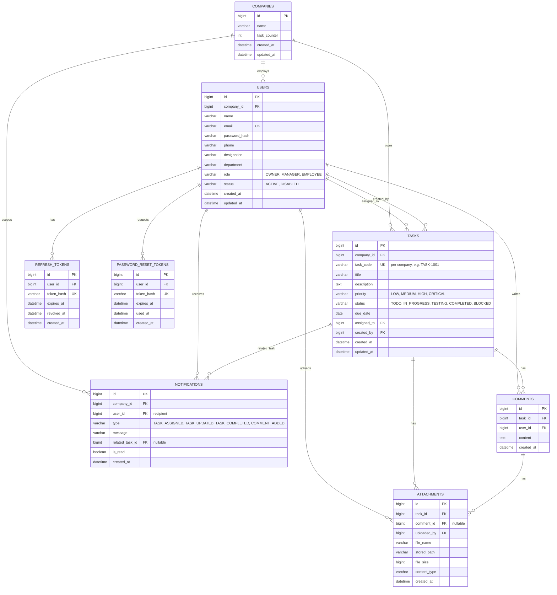

# ER Diagram

## Notes

- **Multi-tenancy**: every row that matters for isolation (`users`, `tasks`, `notifications`) carries `company_id`. `comments` and `attachments` inherit tenancy transitively through `task_id`.
- **Roles**: kept as a `role` enum column on `users` rather than a separate roles/permissions table — the 3 roles (OWNER, MANAGER, EMPLOYEE) are fixed and this keeps the schema simple, matching the "not a full Jira clone" brief.
- **Task codes**: human-readable IDs (`TASK-1001`) are unique *per company*, generated from a `task_counter` column on `companies` that's incremented transactionally when a task is created (application-level, built in Module 3).
- **Attachments**: can belong to a task directly, or to a specific comment on a task (`comment_id` nullable) — covers "Add Attachments" on both tasks and comments.
